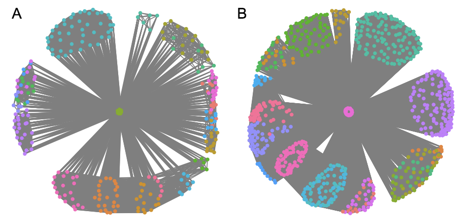

This example will illustrate how to simulate phenotypes that are based on the premises of SConES: they are caused by SNPs interconnected in the underlying network. The simulation has two steps: 1) simulating the causal mechanism and 2) simulating the phenotypes.

We will start by loading `martini`.

```{r load_martini}
library(martini)
```

Before starting, we need to create a network over which we will act.

```{r create_gi}
gi <- get_GI_network(minigwas, snpMapping = minisnpMapping, ppi = minippi)
```

This is a really simple network, formed by only 4 genes. Of these, we will randomly select 2 of them, interconnected in the network, and 30% of their SNPs will be causal.

```{r simulate_snps}
causal <- simulate_causal_snps(gi, ngenes = 2, pcausal = 0.3)

par(mar=c(0,0,0,0)+.1)
plot(gi, mark.groups = names(causal))
```

The selected SNPs are highlighted. As we can see, they match the conditions described before i.e. they are mapped to a gene and are interconnected in the underlying network. Here are some examples of causal mechanisms that are simulated in the human interactome-derived GI network.



This SNPs can be directly passed to `simulate_phenotypes()` in order to simulate a phenotype based on the genotypes on these SNPs on an existing experiment. It starts from an existing GWAS experiment, in order to mantain the linkage disequilibrium patterns, the complexity of the network, etc. of a real case. If the existing GWAS experiment is a case-control, only the controls are used for the simulation.

A quantitative phenotype $y_j$ is simulated for a patient $j$ using the following additive model, proposed in [@Yang2011]:

$$ y_j = \sum\nolimits_i w_{ij} u_i + e_j $$

where the weight $w_{ij}$ is the inclination of the genotype $i$ of patient $j$ over the phenotype; the allelic effect of the $i$-th causal variant $u_i$ in arbitrary units; and the residual effect $e_j$ is the the proportion of the trait not attributable to the genotype. 

The weight $w_{ij}$ is calculated as

$$ w_{ij} = \frac{x_{ij} - 2p_i}{\sqrt{2p_i(1 - p_i)}} $$

where $x_{ij}$ is the number of reference alleles for the $i$-th causal variant of the $j$-th individual; and $p_i$ is the frequency of the $i$-th causal variant. $w_{ij}$ follows a sigmoid like behavior for different $p$: the rarer an allele is, the stronger its impact on the phenotype.

The most interesting bit of this simulation, however, has to do with the residual effect $e_j$, given that it depends directly on the heritability of the trait. $e_j$ is generated from a normal distribution with mean of 0 and variance 

$$ \frac{1}{h^2 - 1} var(\sum\nolimits_i w_{ij} u_i)$$

When all variance is due to genetics ($h^2 = 1$), $e_j = 0$ for every patient $j$.

Our limited `minigwas` is too homogeneous to perform any simulation, so we will first randomly simulate a genotype matrix. Then, we will simualte a phenotype assuming a heritability $h^2=0.9$:

```{r simulate_quantitative_phenotype}
# create a random 100x25 matrix of genotypes
X <- lapply(seq_len(100), function(i) { sample(c(0,1,2), 25, replace = TRUE) })
X <- do.call(rbind, X)

colnames(X) <- minigwas$map$snp.names
rownames(X) <- 1:nrow(X)

X <- X + 1
mode(X) <- "raw"
minigwas$genotypes <- new("SnpMatrix", X)

simulated <- simulate_phenotype(minigwas, snps = causal, h2 = 0.9)
```

`simulate_phenotypes()` returns an object identical to the input GWAS, where the phenotype has been replace by the simulation. Case-control phenotypes are also possible. It is created by dividing in two the aforementioned distribution $y$ into cases and controls. In this case, $y$ reflects the general population, and the number of cases cannot represent a higher proportion than a specified prevalence of the disease.

```{r simulate_qualitative_phenotype}
simulated <- simulate_phenotype(minigwas, snps = causal, h2 = 0.9, qualitative = TRUE,
                                ncases = 10, ncontrols = 40, prevalence = 0.2)
```

# References